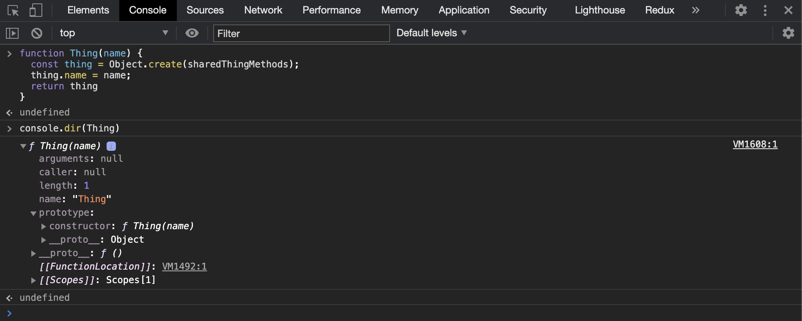
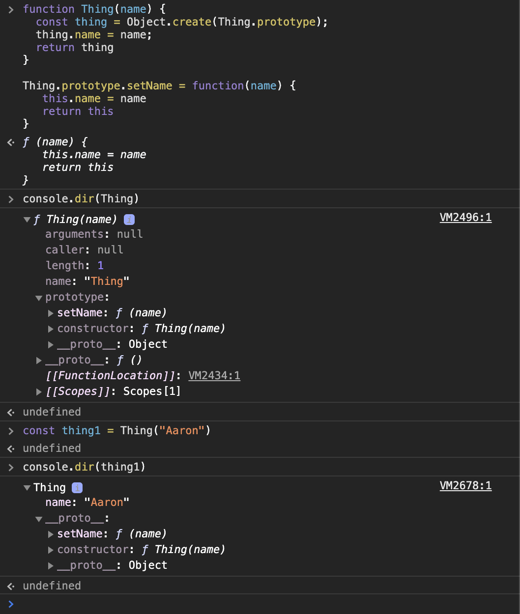
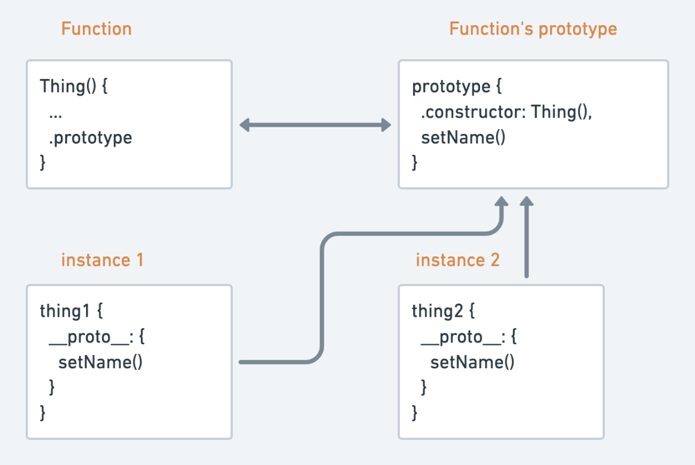

I've recently been trying to get my head around how to make objects in JavaScript (specifically, many of them), as well as understanding `.prototype,` `__proto__`, prototypal inheritance vs class inheritance, and object composition. It's quite a deep subject and this blog post probably scratches the surface but I hope it helps you understand it a little better too.

I'll start by looking at how we make one object and how this evolves to a factory function, constructor function, and classes. Then we'll look at why you might want to favor certain methods.

These thoughts aren't my own, rather an amalgamation of what I've learned elsewhere. What you are about to read, I sourced from the following references. If you don't quite get everything you need from this post I'd encourage you to dig into these:

1. [https://ui.dev/beginners-guide-to-javascript-prototype/](https://ui.dev/beginners-guide-to-javascript-prototype/)
2. [https://medium.com/better-programming/prototypes-in-javascript-5bba2990e04b](https://medium.com/better-programming/prototypes-in-javascript-5bba2990e04b)
3. [https://medium.com/javascript-scene/javascript-factory-functions-with-es6-4d224591a8b1](https://medium.com/javascript-scene/javascript-factory-functions-with-es6-4d224591a8b1)
4. [https://medium.com/javascript-scene/javascript-factory-functions-vs-constructor-functions-vs-classes-2f22ceddf33e](https://medium.com/javascript-scene/javascript-factory-functions-vs-constructor-functions-vs-classes-2f22ceddf33e)
5. [https://medium.com/javascript-scene/master-the-javascript-interview-what-s-the-difference-between-class-prototypal-inheritance-e4cd0a7562e9](https://medium.com/javascript-scene/master-the-javascript-interview-what-s-the-difference-between-class-prototypal-inheritance-e4cd0a7562e9)

## Just one

This is how we make an object in JavaScript:

```jsx
const name = "Aaron"

const thing = {
  name,
  setName(name) {
    this.name = name
    return this
  },
}
```

It's called an object literal. Note the use of shorthand syntax here too. This reads the same as:

```jsx
const thing = {
  name: "Aaron",
  setName: function (name) {
    this.name = name
    return this
  },
}
```

Great, we can make one, what about more than one?

## Factory functions

We could envisage creating a function to make lots of objects looking a bit like this:

```jsx
function Thing(name) {
  const thing = {}
  thing.name = name
  thing.setName = function (name) {
    this.name = name
    return thing
  }
  return thing
}

const thing1 = Thing("Aaron")
```

This is a factory function. It can be written in a couple of different ways including arrow function syntax (more on that later).

Imagine that every instance of `Thing` has a `setName` method. As such, ideally, we would want all instances of `Thing` to share the same `setName` method. We could achieve that like this:

```jsx
const sharedThingMethods = {
  setName(name) {
    this.name = name
    return this
  },
}

function Thing(name) {
  const thing = Object.create(sharedThingMethods)
  thing.name = name
  return thing
}

const thing1 = Thing("Aaron")
```

`[Object.create()](https://developer.mozilla.org/en-US/docs/Web/JavaScript/Reference/Global_Objects/Object/create)` is the key here. It creates a new object and uses its argument as the delegated object for failed lookups. So, say you did `thing1.setName("new name")`, JavaScript will look to `sharedThingMethods` for the `setName()` method as it doesn't exist on the instance of `Thing`.

As it turns, out JavaScript has a built in way of doing the above and it's the functions `.prototype` property.

## What is prototype?

For this bit you will need a browser window open and dev-tools at the ready. No, seriously, don't just read it 😉.

Copy and paste the `Thing` function into the console and then, `console.dir(Thing)`. This will list all the properties of the `Thing` function object and you should have something like below.



Check out `prototype: constructor: f Thing(name)`. What is this and how does it relate to our `sharedThingMethods`?

All functions (defined with the `function` key word - more on this in a bit) have a `.prototype` property that references an object. This object has a `.constructor` property that refers back to the function it belongs to. Turns out, this prototype object functions in more or less the same way as `sharedThingMethods`. As it stands, as you saw in your console, `Thing` isn't making use of it's prototype, let's change that.

```jsx
function Thing(name) {
  const thing = Object.create(Thing.prototype) // <<< This bit changes
  thing.name = name
  return thing
}

Thing.prototype.setName = function (name) {
  this.name = name
  return this
}

const thing1 = Thing("Aaron")
```

Now, on failed lookups, instead of being referred to the `sharedThingMethods` object we will be referred to the prototype. We now have a situation like this:



Note `setName` on the functions `.prototype` and the instances `__proto__`.

You could also picture it like this:



Every instance of `Thing` has a `__proto__` property that refers to the Functions `.prototype`. `setName` is shared among all instances of `Thing` via the functions prototype.

## Factory functions 3 ways

So we understand that we can create a factory function to make lots of objects and we also understand what role the factory functions prototype plays in that. But, what happens when you use an Arrow function to define your factory function?

These three factory functions are almost identical, but there's a slight difference, can you tell?

```jsx
// Factory 1 (the one we have already been looking at)
function Thing(name) {
  const thing = Object.create(Thing.prototype)
  thing.name = name
  return thing
}

Thing.prototype.setName = function (name) {
  this.name = name
  return this
}

const thing1 = Thing("Aaron")

// Factory 2
const proto = {
  setName(name) {
    this.name = name
    return this
  },
}

const Thing = name => {
  const thing = Object.create(proto)
  thing.name = name
  return thing
}

// Factory 3 ()
const Thing = name => ({
  name,
  __proto__: {
    setName(name) {
      this.name = name
      return this
    },
  },
})
```

What the hell is going on here? Why, with 'factory 2' does it look like we are going back to manually setting a prototype object and what's with the `__proto__` in factory 3?

**In summary**: all these functions employ prototype delegation, they just do it differently. The first two are functionally equivalent - they share a single prototype between all instances. The last is different in memory usage. It creates a new prototype for each instance.

That's a lot of words, let's elaborate.

[Arrow functions](https://developer.mozilla.org/en-US/docs/Web/JavaScript/Reference/Functions/Arrow_functions) do not have a `.prototype` property, meaning they cannot be used as constructor functions (more on constructors in a bit) but they can be used as factory functions like above. Looking at factory 2, the lack of `.prototype` means you must delegate a prototype object yourself and pass it to `Object.create()`. Whether you go for factory 1 or 2 is completely a matter of preference but they both behave the same.

Factory 3 is different in that, is does create a prototype by defining `__proto__` but it creates a new prototype for every instance created and lacks the memory saving benefit the other 2 have. So what is the point of the prototype in factory 3? Say we want to iterate over our `Thing` instance using something like `Object.keys(thing1)`, we may wish to exclude methods like `setName` from this operation. Because some properties are common among all instances, including them may create unwanted 'noise' with little meaning. Putting them on the `__proto__` property hides them from view.

## From factory to constructor

So we've looked at factory functions, how they can be used to make multiple instances of objects, how we can create a prototype chain for delegation for object property lookups and how that might look difference depending on how you write your factory functions. Now let's look at how JavaScript adds some syntactical sugar to this whole process with constructor functions and classes.

A function is a constructor function if it is invoked with the `new` keyword i.e. `const thing1 = new Thing("Aaron")`. Transforming our factory function into a constructor function we can omit a few lines.

```jsx
function Thing(name) {
  // const this = Object.create(Thing.prototype);
  this.name = name
  // return this
}

Thing.prototype.setName = function (name) {
  this.name = name
  return this
}

const thing1 = new Thing("Aaron")
```

With a constructor function, the two lines that are commented out above are done for you implicitly. Note the object created is called `this` and is implicitly returned for you.

## From constructor to class

Just a pinch more syntactical sugar with the `class` keyword leads us to this:

```jsx
class Thing {
  constructor(name) {
    this.name = name
  }
  setName(name) {
    this.name = name
    return this
  }
}

const thing1 = new Thing("Aaron")
```

It's important to note, this is functionally equivalent to the constructor function above. It just looks different.

If you want to put `setName` on each instance of class rather than on the prototype you can set it as a `static` method like so:

```jsx
class Thing {
  constructor(name) {
    this.name = name
  }
  static setName(name) {
    this.name = name
    return this
  }
}

const thing1 = new Thing("Aaron")
```

## Factory functions vs constructors vs classes

This post has worked through factory functions to constructors to classes, but let's take a step back and look at when we might use one over the other.

Classes are the same as constructor functions with a little more syntactical sugar. So, the pros and cons of constructor functions also apply to classes.

Constructors force callers to use the `new` keyword. Factories don't. That's the only difference but this does have some side effects.

Factory functions are sometimes regarded as an upgrade to constructor functions and is actually a common refactoring pattern.

Just to recap - the usage of the `new` keyword causes JavaScript to automatically create a new object, set `this` within the function to that object and return the object. This does not happen automatically in a factory function. You need to tell a factory function what to return (in most cases the new object) but this does add for a little more flexibility.

```jsx
function ConstructorThing(name) {
  this.name = name
}
ConstructorThing.prototype.setName = function (name) {
  this.name = name
  return this
}

function factoryThing(name) {
  const obj = {
    name,
    setName(name) {
      this.name = name
      return this
    },
  }
  // Other code to manipulate obj in some way here
  return obj
}
```

The fact that we can include other code to manipulate the object in some way and define the object to be returned means that the return value could vary based on parameters.

This flexibility is also beneficial from an [encapsulation](https://www.aaron-thompson.dev/posts/code-encapsulation-40mm/) perspective. Consider the following factory function:

```jsx
function createWallet() {
  const balance = 0

  function privateMethod() {
    console.log("do a private thing")
  }
  function add() {
    console.log("add")
  }
  function empty() {}

  return Object.freeze({
    add,
    empty,
  })
}
```

Only the methods we expose in the return are public. Everything else is encapsulated.

By default class (and by extension constructor) properties are public and can be examined or modified outside the class. That being said, private fields are available in classes as an [experimental feature](https://developer.mozilla.org/en-US/docs/Web/JavaScript/Reference/Classes/Private_class_fields).

Classes and constructors can create problematic hierarchies that lead to well-known problems in object oriented design, including fragile base classes, the 'gorilla banana problem' and the duplication by necessity. By using factory functions you can adopt an approach where composition is favored over inheritance but that's a huge topic for another blog post!

This is a huge topic and I'm looking forward to writing about it some more. I'm still learning so, as always, any constructive comments are appreciated.
